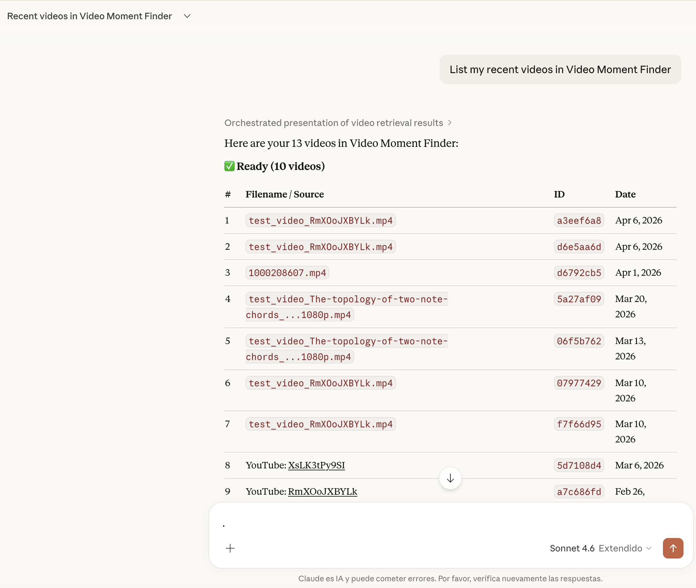
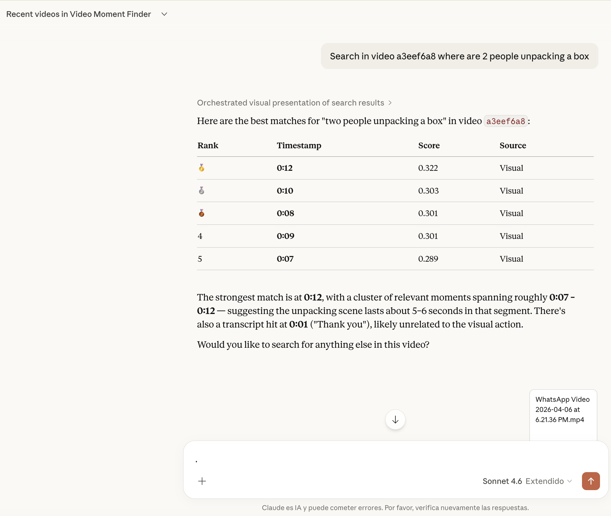
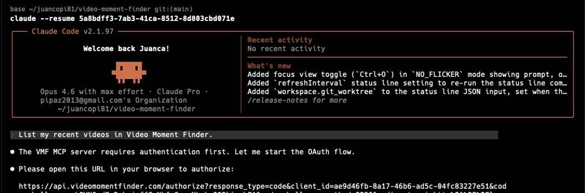
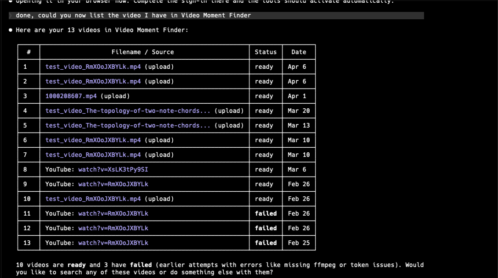
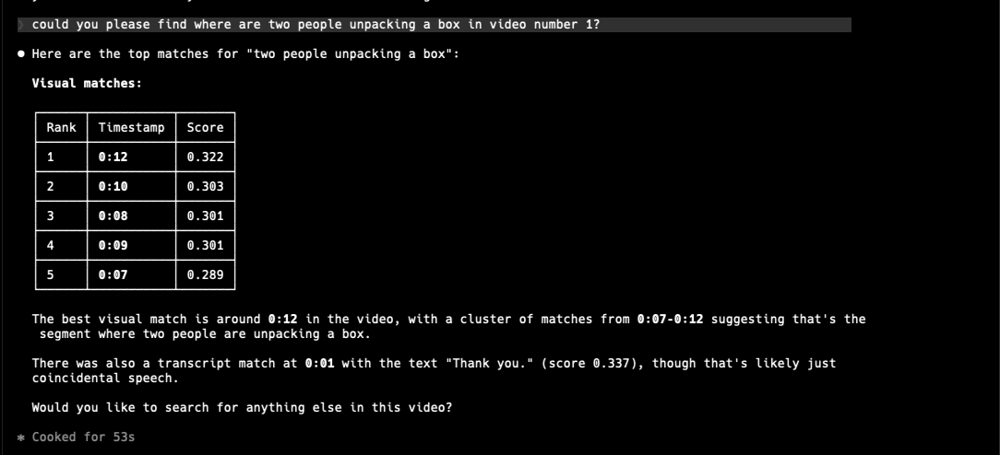
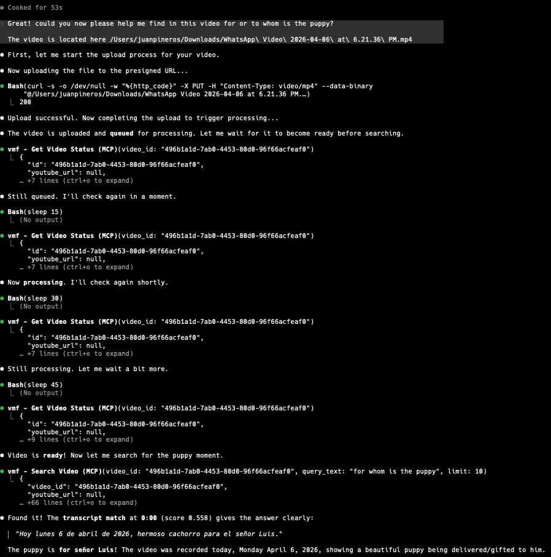

# Video Moment Finder

Semantic and transcript-aware video moment search for creators and researchers.
Process a video, run text or image queries, and jump to matching timestamps.

**Live site:** [videomomentfinder.com](https://videomomentfinder.com)

Public agent entrypoints:

- [developers](https://www.videomomentfinder.com/developers)
- [Claude connector approval](https://www.videomomentfinder.com/connectors/claude)
- [skill.md](https://www.videomomentfinder.com/skill.md)
- [openapi.json](https://api.videomomentfinder.com/openapi.json)

Video Moment Finder exposes two external integration surfaces:

- REST API + CLI, authenticated with `vmf_` API keys
- Remote MCP at `https://api.videomomentfinder.com/mcp`, authenticated with OAuth 2.0 authorization-code + PKCE for Claude-compatible clients

## What It Does

- Accepts direct video uploads as the reliable ingest path.
- Supports best-effort YouTube URL import for videos you own or are authorized to use.
- Processes video frames asynchronously.
- Stores YouTube transcript segments when subtitle or automatic caption tracks are available.
- Embeds frames into a vector index for semantic retrieval.
- Runs text queries across visual retrieval and semantically indexed transcript retrieval.
- Returns top timestamped matches for text or example-image queries, with thumbnails when visual matches are available.
- For text queries, the `limit` applies per result group: up to `limit` visual matches and up to `limit` spoken matches.
- Exposes the upload, poll, and text-search happy path through a thin CLI over `/api/v1`.
- Publishes a curated public OpenAPI schema for the same upload, poll, and text-search contract.

Current transcript scope:

- YouTube videos use existing subtitle tracks or automatic caption tracks when available and index them for semantic transcript retrieval.
- YouTube videos currently do not fall back to Whisper when no caption track is available.
- Direct uploads extract speech with Whisper large-v3-turbo via `faster-whisper` and index those transcript segments for spoken-text queries.

## Use with MCP clients (Claude, Codex, …)

Video Moment Finder ships a remote [Model Context Protocol](https://modelcontextprotocol.io) server (Streamable HTTP + OAuth with dynamic client registration and PKCE) that lets an AI agent list, upload, and search your videos directly from a conversation.

| Surface | How to connect |
|---------|---------------|
| **Claude.ai / Claude Desktop** | Add a custom connector with server URL `https://api.videomomentfinder.com/mcp`. Claude handles OAuth and opens the approval flow automatically. |
| **Claude Code (CLI)** | Add the MCP server in your project or global config. Claude Code runs locally and can drive the same upload, status, and search flow end to end. |
| **Codex (CLI)** | `codex mcp add vmf --url https://api.videomomentfinder.com/mcp` then `codex mcp login vmf`. Codex reads the server instructions for the cross-tool workflow guidance. |

### Available tools

| Tool | Access | Description |
|------|--------|-------------|
| `list_videos` | Read | List your recent videos with status, source, and upload date |
| `get_video_status` | Read | Check whether a video is queued, processing, or ready |
| `search_video` | Read | Search a video by text and get timestamped matches (visual + transcript) |
| `get_transcript` | Read | Fetch the full spoken transcript with per-segment timestamps |
| `get_frames` | Read | Fetch frame images at specific timestamps (image content, high-res by default) |
| `upload_video` | Write | Upload a video file via two-step presigned URL flow |

Video Moment Finder also ships a `lecture_notes` MCP prompt that chains
`get_transcript` and `get_frames` into a guided workflow for turning an
indexed lecture into Markdown study notes. MCP prompts are user-invoked
(e.g. from the claude.ai prompt menu); agents and clients without prompt
support get the same workflow from the server instructions. See
[docs/LECTURE_NOTES_RECIPE.md](./docs/LECTURE_NOTES_RECIPE.md).

### Claude.ai

Ask Claude to work with your videos in natural language. The connector authenticates via OAuth and bills usage against your Developer Pack API units.

<p align="center">
  
</p>
<p align="center"><em>Listing videos &mdash; Claude returns a formatted table of your indexed videos with status and dates.</em></p>

<p align="center">
  
</p>
<p align="center"><em>Searching a video &mdash; "find where 2 people are unpacking a box" returns ranked timestamps with confidence scores.</em></p>

### Claude Code (CLI)

Claude Code connects the same way but runs locally, which means it can also handle the full upload-process-search pipeline end to end.

<p align="center">
  
</p>
<p align="center"><em>One-time OAuth &mdash; Claude Code opens a browser for approval, then stores the token for future sessions.</em></p>

<p align="center">
  
</p>
<p align="center"><em>Listing videos &mdash; same data, terminal-native table formatting.</em></p>

<p align="center">
  
</p>
<p align="center"><em>Searching a video &mdash; visual and transcript matches with timestamps and scores.</em></p>

<p align="center">
  
</p>
<p align="center"><em>Full pipeline &mdash; upload a video, poll until processing completes, then search it, all in one conversation.</em></p>

### Auth and billing

- The MCP endpoint (`/mcp`) uses OAuth 2.0 authorization-code + PKCE.
- REST API and CLI keep their existing `vmf_` API-key flow.
- Connector usage bills against [Developer Pack](https://www.videomomentfinder.com/developers) API units.
- Approval page: [videomomentfinder.com/connectors/claude](https://www.videomomentfinder.com/connectors/claude)
- The approval flow handles sign-in, Developer Pack balance checks, and explicit tool approval for the connected account.

Privacy and support:

- [Privacy policy](https://www.videomomentfinder.com/privacy)
- [Support](https://www.videomomentfinder.com/support)

## Quick Start (Local)

### Prerequisites

- Python 3.11+
- Node.js 18+
- `uv` and `npm`
- Supabase project and database credentials

### 1) Configure environment

```bash
cp .env.example .env
cp frontend/.env.example frontend/.env.local
```

Fill required values in both files.
For service ownership and operations detail, see [docs/DEPLOYMENT.md](./docs/DEPLOYMENT.md).

### 2) One-command setup

```bash
set -a && source .env && set +a
./scripts/setup_local.sh
```

### 3) Run services

Backend API:

```bash
uv run uvicorn src.api.app:app --reload --port 8000
```

Worker:

```bash
uv run python -m src.worker.runner
```

Frontend:

```bash
cd frontend && npm run dev
```

### Local Development (Supabase + Qdrant Isolation)

To develop with a local database and vector store (no production queue
or index interference):

1. Install the Supabase CLI: `brew install supabase/tap/supabase`
2. Copy the local config: `cp .env.local.example .env.local`
3. Start local services: `just dev-services`
4. Run API and worker as usual: `just api` / `just worker`

Local Supabase runs on port 54321/54322. Local Qdrant runs on port 6333
via Docker. Modal GPU functions and R2 storage are still shared with
production (stateless).

### 4) Verify quality checks

```bash
./scripts/workflow/check_all.sh
```

## High-Level Architecture

```text
Next.js frontend -> FastAPI API -> Supabase-backed queue -> Python worker -> Modal GPU
                                            |                  |                |
                                            v                  v                v
                                         Supabase           Qdrant      Cloudflare R2
```

Core flow:

1. User uploads a video or optionally submits an owned YouTube URL.
2. API enqueues a processing job.
3. Worker extracts frames and sends embedding work to Modal.
4. Embeddings are stored in Qdrant and thumbnails in R2.
5. User searches with text or an example image and receives timestamped matches.

Reliable production ingest path: browser upload -> direct-to-R2 storage -> worker processing.
YouTube URL import remains best effort and may be blocked by server-side restrictions.

## Documentation Map

- [PROJECT_SPEC.md](./PROJECT_SPEC.md): stable product charter.
- [ROADMAP.md](./ROADMAP.md): future work only.
- [STATUS.md](./STATUS.md): execution history only.
- [docs/DEPLOYMENT.md](./docs/DEPLOYMENT.md): deployment env ownership, webhook contract, and upload flow reference.
- [docs/CLI_API_GUIDE.md](./docs/CLI_API_GUIDE.md): public CLI and external API happy-path guide.
- [docs/MCP_GUIDE.md](./docs/MCP_GUIDE.md): OAuth connect flow, reviewer setup, validation gates, and submission notes.
- [docs/LECTURE_NOTES_RECIPE.md](./docs/LECTURE_NOTES_RECIPE.md): recipe for turning an indexed lecture video into Markdown study notes.
- [frontend/public/skill.md](./frontend/public/skill.md): public agent bootstrap with canonical URLs and security rules.

## Deployment (At a Glance)

- Frontend: Vercel (`frontend/`)
- API + worker: Railway (`Dockerfile`, `Dockerfile.worker`)
- Data: Supabase + Qdrant + Cloudflare R2

Detailed operational runbooks are intentionally kept out of README; use `docs/DEPLOYMENT.md` for operations reference.

## License

This project is licensed under the [GNU Affero General Public License v3.0](./LICENSE).

If you run a modified version as a network service, you must make the complete source code available to its users.
